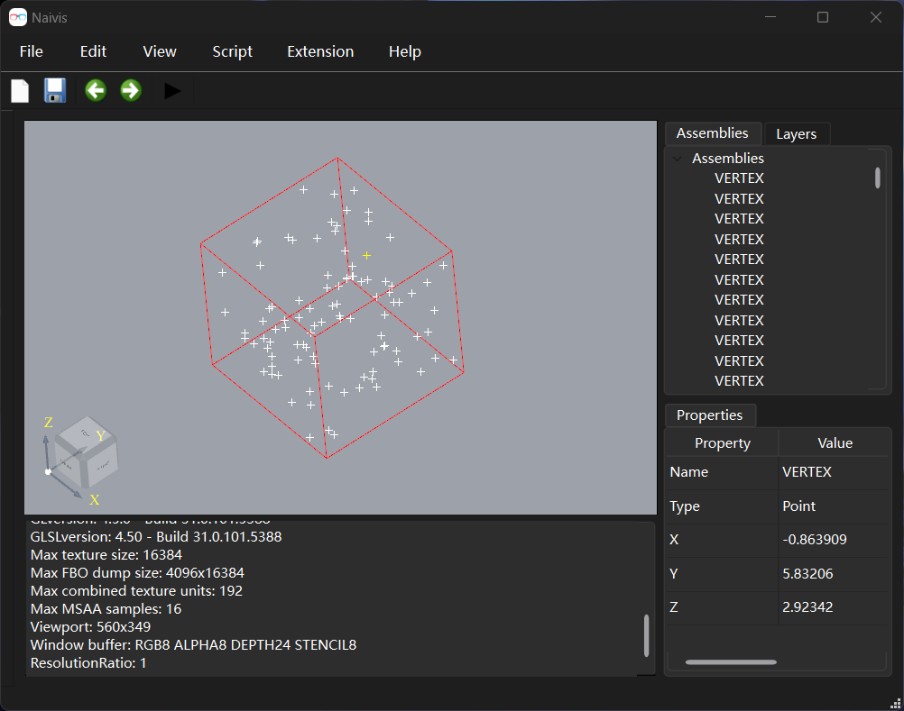

<p align="center">
  
  <p align="center">A geometry visualization tool.</p>
</p>

---

<p align="center">
  
</p>

# Build
- Clone the repository
  ``` sh
  git clone https://github.com/AnthonyK213/Naivis.git
  ```
- Install dependencies
  - Install the latest release of [vcpkg](https://github.com/microsoft/vcpkg)
    - Set environment variable `VCPKG_ROOT`
  - Install `pkg-config`
    - For [windows](https://stackoverflow.com/questions/1710922/how-to-install-pkg-config-in-windows)
  - [Qt](https://www.qt.io/download-open-source)
    - Set environment variable `QT_DIR`
  - [OCCT](https://github.com/Open-Cascade-SAS/OCCT) >= 7.6.0 is needed on Linux,
    since the vcpkg port on Linux is not usable.
    - Build & Install (on Linux)
    - Set environment variable `OCCT_DIR` (on Linux)
- Configure with cmake
- Build
